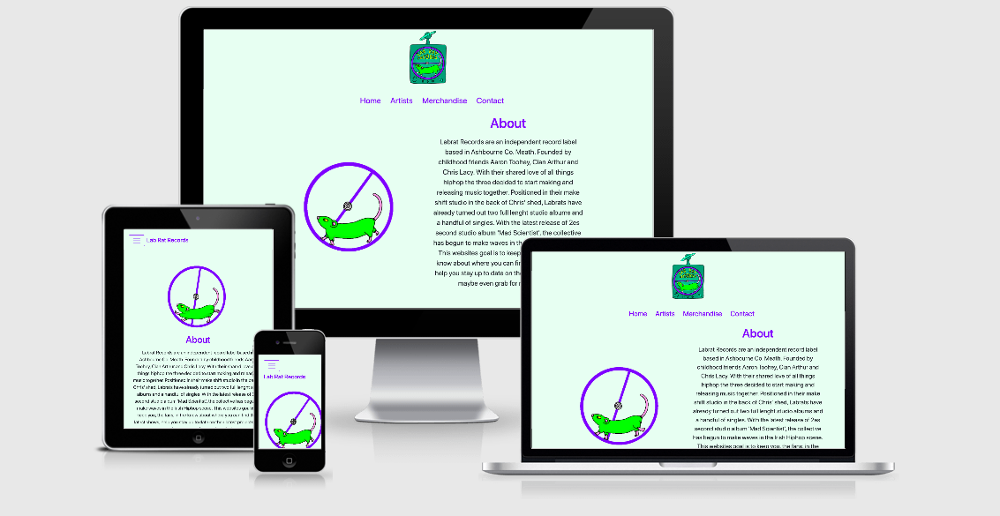

<h1 align="center">Mile Stone Project One</h1>

[View full webpage here](https://podgecollins.github.io/MileStoneProjectOne/) 

This web site is to promote the Independent Hiphop collective known as Labrat Records.
This website was create to give new and old fans an opportunity to keep up to date
with the collectives upcoming shows, learn more about the collectives history and book
them for future events.

<h2 align="center"></h2>

# UX User Experience:

## User stories:

### First Time Visitor Goals:
    -As a First Time Visitor, I want to easily understand the main purpose of the site and learn more about the organisation

    -As a First Time Visitor, I want to be able to easily be able to navigate throughout the site to find content

### Returning Visitor Goals:
    -As a Returning Visitor, I want to find the best way to get in contact with the organisation with any questions I may have

    -As a Returning Visitor, I want to find the Social Media links so that I can follow and interact with the artists latest posts

### Frequent User Goals:
    -As a Frequent User, I want to check to see if there are any newly added merchandise to the website

    -As a Frequent User, I want to check to see if the artist is playing new shows

## Design:

### Colour Scheme:
    -The main colours used are Purple for the text, icons & clicking text boxes, 
    a light pink for hovering over navbar and icons and bluish white hue to the background.

### Typography:
    -The Roboto font is the main font used throughout the whole website with Sans Serif 
    as the fallback font in case for any reason the font isn't being imported into the 
    site correctly. Roboto is a clean font used frequently in programming, so it is both 
    aesthically appealing and appropriate.

### Imagery:
    -The imagery was important as I need to show the collectives Logo, the artists themselves
    and merchandise they wished to sell on the website. I feel the collectives artwork
    is original and gets across the energy the collective emit

## Wireframes: 

    Original Desktop Wireframe - [View](https://www.figma.com/file/mpTebBAEi2QM3FZmjdXDHi/Lab-Rats-Mock-Up?node-id=0%3A1)

    Original Mobile Wireframe - [View](https://www.figma.com/file/mpTebBAEi2QM3FZmjdXDHi/Lab-Rats-Mock-Up?node-id=10%3A151)

# Features:

    Responsive on all Devices 

    Interactives Elements

# Technologies Used:

## Languages Used:

    HTML 5

    CSS

## Frameworks, Libraries and Programs Used:

### Bootstrap v 4.2.1
    - This was used to help with responsiveness and styling of website 

### Bootstrap v 3.4.1.
    - This was used for jquery

### Jquery
    -Used to position navbar and fix it to top after the hero image was scrolled by

### Google Fonts
    -Used to import Roborto font into my style.css

### Font Awesome
    -Used for all my icons on index.html

### Git 
    -Used for version control by utilizing the gitpod terminal to commit to Git and Push to github

### Github
    -Used to store repositories 

### Photoshop
    -Used to create and edit the Hero Image and the pngs on the merchandise page

### Figma
    -Used to create the wireframes of what I wanted my website to look like

# Testing 

The W3C Markup Validator and W3C CSS Validator Services were used to validate every 
page of the project to ensure there were no syntax errors in the project.

W3C Markup Validator - [Results](https://github.com/PodgeCollins/MileStoneProjectOne/tree/master/assets/Validation%20images)

W3C CSS Validator - [Results](http://jigsaw.w3.org/css-validator/validator?uri=https%3A%2F%2Ff720af12-d07b-4ac6-8668-0870756cc90f.ws-eu03.gitpod.io%2F%23%2Fworkspace%2FMileStoneProjectOne&profile=css3svg&usermedium=all&warning=1&vextwarning=)

## Testing User Stories from User Experience (UX) Section:

### First Time Visitor Goals:

#### As a First Time Visitor, I want to easily understand the main purpose of the site and learn more about the organisation:

    -Upon entering the site, users are automatically greeted with a Hero Image
    and a clean and easily readable navigation bar to go to the page of their choice. 
    Underneath there is an About section with Text about the history of the collective.

    -The user has can scroll down and see where the collective are playing their latest shows. 

#### As a First Time Visitor, I want to be able to easily be able to navigate throughout the site to find content:

    The site has been designed to be fluid and never to entrap the user. At the top of 
    each page there is a clean navigation bar, each link describes what the page they will 
    end up at clearly.
    
    On the Contact Us Page, after a form response is submitted, the page refreshes and the 
    user is brought to the top of the page where the navigation bar is.

### Returning Visitor Goals:

#### As a Returning Visitor, I want to find the best way to get in contact with the organisation with any questions I may have:

    The navigation bar clearly highlights the "Contact Us" Page.

    Here they can fill out the form on the page or are told that alternatively they can message 
    the organisation on social media.

    The footer contains links to the organisations Facebook, Twitter and Instagram page.

    Whichever link they click, it will be open up in a new tab to ensure the user can easily 
    get back to the website.

#### As a Returning Visitor, I want to find the Social Media links so that I can follow and interact with the artists latest posts:

    The Social media links can be found at the footer of every page and will open a new tab for the user 
    and more information can be found on these pages.

### Frequent User Goals:

#### As a Frequent User, I want to check to see if there are any newly added merchandise to the website:

    The user would already be comfortable with the website layout and can easily click 
    the merchandise page and check to see if new merchandise has been added.  

#### As a Frequent User, I want to check to see if the artist is playing new shows:

    The user would already be comfortable with the website layout and can easily 
    check the bottom of the landing page.

## Furthur Testing:

    -The Website was tested on Google Chrome & Safari 

    -It was viewed on a variety of devices such a Laptop, Iphone 11, Ipad and Oneplus5

    -A large amount of testing was done to ensure that all pages were linking correctly.

    -My brother was asked to review the site and documentation to point out any bugs and/or 
    user experience issues.

## Known Bugs

    -The hero image would bounce down before allowing the navbar to scroll by and fix position.
    To correct this I added a ToggleClass of extra padding to the Jquery to stop this from happening.

    -The same bouncing issue became to happen when the website would respond with small screens.
    To correct this I wrote a media query to cancel out the extra padding on screen sizes smaller
    than 992px.

# Deployment:

## GitHub Pages:

### The project was deployed to GitHub Pages using the following steps:

1. Log in to GitHub and locate the [GitHub Repository](https://github.com/)
    
2. At the top of the Repository (not top of page), locate the "Settings" 
   Button on the menu.

3. Scroll down the Settings page until you locate the "GitHub Pages" Section.
    
4. Under "Source", click the dropdown called "None" and select "Master Branch".

5. The page will automatically refresh.
    
6. Scroll back down through the page to locate the now published site link in the "GitHub Pages" section.

## Forking the GitHub Repository:

### By forking the GitHub Repository we make a copy of the original repository on our GitHub account to view and/or make changes without affecting the original repository by using the following steps:

1. Log in to GitHub and locate the [GitHub Repository](https://github.com/)
    
2. At the top of the Repository (not top of page) just above the "Settings" 
   Button on the menu, locate the "Fork" Button.
    
3. You should now have a copy of the original repository in your GitHub account.

### Making a Local Clone:

1. Log in to GitHub and locate the [GitHub Repository](https://github.com/)

2. Under the repository name, click "Clone or download".

3. To clone the repository using HTTPS, under "Clone with HTTPS", copy the link.
    
4. Open Git Bash
    
5. Change the current working directory to the location where you want the cloned 
   directory to be made.

6. Type git clone, and then paste the URL you copied in Step 3.

$ git clone https://github.com/PodgeCollins/MileStoneProjectOne  

7. Press Enter. Your local clone will be created.

$ git clone https://github.com/PodgeCollins/MileStoneProjectOne
    
    > Cloning into `CI-Clone`...
    > remote: Counting objects: 10, done.
    > remote: Compressing objects: 100% (8/8), done.
    > remove: Total 10 (delta 1), reused 10 (delta 1)
    > Unpacking objects: 100% (10/10), done.

Click [Here](https://docs.github.com/en/free-pro-team@latest/github/creating-cloning-and-archiving-repositories/cloning-a-repository#cloning-a-repository-to-github-desktop) to retrieve pictures for some of the buttons and more detailed explanations of the above process.

### 

# Credits

## Code: 

### [Bootstrap 4.3](https://getbootstrap.com/docs/4.3/getting-started/introduction/) 

    Bootstrap Library used throughout the project mainly to make site responsive using the Bootstrap Grid System.

### [Bootstrapping Your Next Big Idea With Bootstrap 4](https://courses.codeinstitute.net/courses/course-v1:codeinstitute+FE+2017_T3/courseware/a4b90d17e5c94220a0f83f00ce7fa606/7c0e25d1061e47cdae9c492d623bfc65/?child=first)

    Alot of the code used in this website came from this tutorial.

### [Bootstrap CDN](https://bootstrap-menu.com/detail-fixed-onscroll.html)

    This code helped me figure out how to have a fixed navbar after scrolling.

### [Bootstrap 4 remove blue glow](https://www.xspdf.com/resolution/52531741.html)

    Code was taken from this page to help remove the outter glow on the submit button on contact.html

### [Change Bootstrap input focus blue glow](https://stackoverflow.com/questions/14820952/change-bootstrap-input-focus-blue-glow)

    Code was taking to change the styling of 'form-control:focus'

### [Adding gif](https://www.webdeveloper.com/d/102490-how-to-add-an-animated-gif-to-a-css-or-html-page-please)  

    This code used to answer this question helped me place an animated gif into my project via my css rather than using <iframe>.
  

## Content:

    All content was written by developer

## Media:

All Labrat related content were created by [Seanbrendog]
the gif on index.html can be located [here](https://giphy.com/seanbrendog)

Seanbrendog also provided the hero image used at the top of the page and images on artist.html.  

These images were edited by the developer to suit this website

[Black T-shirt template](https://www.freepik.com/photos/shirt)  

[Hoodie template](https://www.freepik.com/photos/winter)

[Clothing photos created by](www.freepik.com)

[Vinyl Record template](https://www.discmakers.com/templates/vinyl.asp)

## Acknowledgements: 

Cheers to my Mentor for feedback